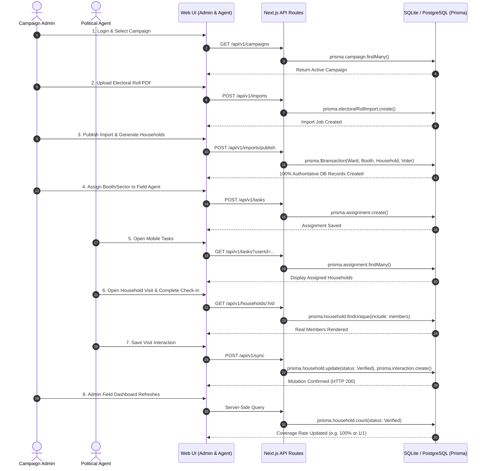

# GOLDEN PATH 01 — SPECIFICATION & VERIFICATION PLAN

**Workflow Objective:**  
Zero Mock End-to-End Campaign Field Lifecycle:  
`LOGIN` → `SELECT CAMPAIGN` → `IMPORT VOTER DATA` → `CREATE VOTERS` → `CREATE/SUGGEST HOUSEHOLDS` → `ASSIGN HOUSEHOLDS TO AGENT` → `AGENT OPENS MOBILE TASK` → `AGENT COMPLETES HOUSEHOLD VISIT` → `SERVER SAVES INTERACTION` → `ADMIN DASHBOARD UPDATES` → `REFRESH BROWSER` → `DATA REMAINS PERSISTENT`

---

## Participating APIs & Database Tables

---

## Action Plan for Golden Path 01:
1. **Fix `src/app/agent/search/page.tsx`**: Replace `mockVoters` with live search query against `GET /api/v1/voters?q=...`.
2. **Implement `src/app/api/v1/households/[hid]/route.ts`**: Return live household with associated members.
3. **Fix `src/app/agent/visit/[hid]/page.tsx`**: Fetch live household details & members dynamically from `/api/v1/households/[hid]`.
4. **Fix `src/app/agent/tasks/page.tsx`**: Ensure task link points to the exact assigned household ID instead of static `H-001`.
5. **Run End-to-End Automated Script**: Execute every step from import to visit completion and verify DB persistence.
