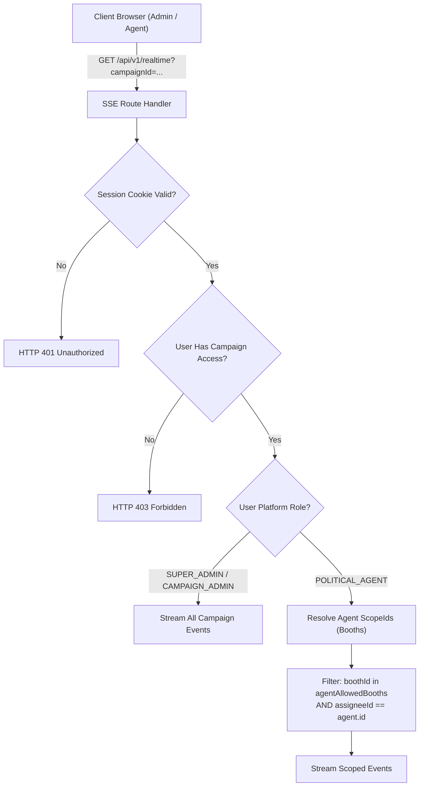

# RECOVERY STEP 7 — REALTIME EVENT MATRIX
**Project:** CampaignOps AI  
**Protocol:** Server-Sent Events (SSE) via `/api/v1/realtime`  
**Single Source of Truth:** PostgreSQL (`AuditEvent` streaming + authoritative REST refetch)

---

## 1. Event Definitions & Scoping Rules

| Event Action (`event`) | Triggering Mutation | Emitted Details | Recipient Scoping | Refetch Target |
| :--- | :--- | :--- | :--- | :--- |
| `connected` | Initial stream handshake | `{ time, status: 'CONNECTED', campaignId, role }` | Requesting authenticated user | None (handshake) |
| `FIELD_VISIT_RECORDED` | `POST /api/v1/households/[hid]` | `{ householdId, status, boothId, agentId }` | Admins of campaign; Agents assigned to `boothId` | `/api/v1/campaigns/[id]`, `/api/v1/households/[hid]` |
| `ASSIGNMENT_CREATED` | `POST /api/v1/tasks` | `{ assignmentId, assigneeId, scopeType, boothId }` | Admins of campaign; Assignee Agent if matching `assigneeId` & `boothId` | `/api/v1/tasks`, `/agent` view |
| `ASSIGNMENT_UPDATED` | `PATCH /api/v1/tasks/[id]` | `{ assignmentId, status, boothId }` | Admins of campaign; Assignee Agent | `/api/v1/tasks`, `/agent` view |
| `HOUSEHOLD_CONFIRMED` | `POST /api/v1/households/[hid]/confirm` | `{ householdId, code, boothId }` | Admins of campaign; Agents assigned to `boothId` | `/api/v1/households/[hid]` |
| `HOUSEHOLD_SPLIT` | `POST /api/v1/households/[hid]/split` | `{ parentId, newHouseholdId, boothId }` | Admins of campaign; Agents assigned to `boothId` | `/api/v1/households`, `/campaigns/[id]/field` |
| `HOUSEHOLD_MEMBER_MOVED` | `POST /api/v1/households/[hid]/move-member` | `{ sourceId, targetId, voterId, boothId }` | Admins of campaign; Agents assigned to `boothId` | `/api/v1/households/[hid]` |
| `ISSUE_CREATED` | `POST /api/v1/issues` | `{ issueId, campaignId, priority, boothId }` | Admins of campaign; Agents assigned to `boothId` | `/api/v1/issues`, `/agent` bell badge |
| `: ping <timestamp>` | Keep-alive timer (every ~15s) | Comment line (`: ping ...`) | All connected clients | Ignored by application (connection maintainer) |

---

## 2. Security & RBAC Scoping Pipeline

---

## 3. Client Reconnection & Deduplication Lifecycle

1. **Connection Lifecycle**:
   - `EventSource` initialized with `{ withCredentials: true }`
   - Connection state transitions: `DISCONNECTED` $\rightarrow$ `CONNECTED` $\rightarrow$ `RECONNECTING` (on transient error with debounced retry)
2. **Deduplication**:
   - Every event emitted by PostgreSQL includes an `AuditEvent.id` as the SSE `id:` field.
   - Client records `seenEventIds` in a circular buffer (up to 200 items). Duplicate events arriving during network reconnects are discarded without duplicate API calls.
3. **Resumption via `Last-Event-ID`**:
   - Upon reconnecting, `EventSource` automatically sends `Last-Event-ID: <audit.id>`.
   - The server queries `AuditEvent` where `createdAt > priorEvent.createdAt`, preventing missed operational updates during temporary network blips.
4. **Authoritative Single Source of Truth**:
   - Realtime event payloads are purely informational signals (containing IDs and timestamps, zero voter PII).
   - Receiving an event triggers a debounced (300-400ms) authoritative refetch against the REST API / PostgreSQL database, ensuring all calculations and validations remain 100% server-authoritative.
