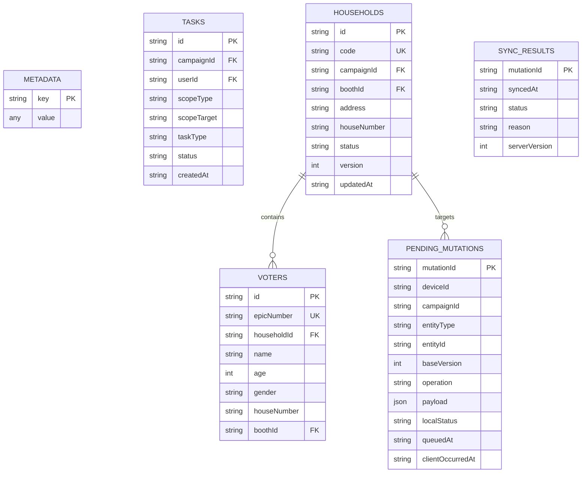

# RECOVERY STEP 8 — OFFLINE DATA MODEL SPECIFICATION
**Project:** CampaignOps AI  
**Store:** IndexedDB Database (`campaignops_agent_offline_db`, Version `1`)  
**Authority:** Client-side operational subset cache (PostgreSQL remains Single Source of Truth)

---

## 1. Object Store Schemas

---

## 2. Store Definitions & Indices

### 1. `metadata` Store
- **Key**: String (`cache_timestamp`, `last_successful_sync`, `agent_summary`, `active_campaign_id`).
- **Purpose**: Persists configuration flags, timestamp of latest downloaded snapshot, and active campaign state.

### 2. `tasks` Store
- **KeyPath**: `id`
- **Indices**: `campaignId`
- **Purpose**: Stores active assignments and sector responsibilities assigned specifically to the authenticated Political Agent.

### 3. `households` Store
- **KeyPath**: `id`
- **Indices**: `code`, `boothId`, `campaignId`
- **Purpose**: Stores minimal household operational attributes (code, address, status, optimistic version, primary contact) for authorized polling booths. Does NOT cache full voter roll or out-of-scope precincts.

### 4. `voters` Store
- **KeyPath**: `id`
- **Indices**: `epicNumber`, `householdId`, `name`
- **Purpose**: Minimal elector roster (name, age, gender, EPIC number, house number) enabling offline door-to-door search and family verification.

### 5. `pendingMutations` Store
- **KeyPath**: `mutationId`
- **Indices**: `localStatus`, `queuedAt`
- **Purpose**: Append-only FIFO queue of field updates executed while disconnected. Survives browser refresh, app restarts, and temporary offline reboots.

### 6. `syncResults` Store
- **KeyPath**: `mutationId`
- **Indices**: `syncedAt`
- **Purpose**: Historical audit log of synchronization responses returned by PostgreSQL `/api/v1/sync`.
