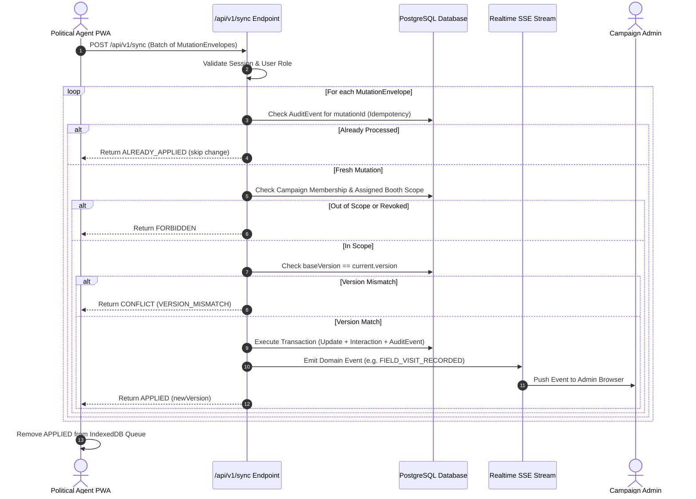

# RECOVERY STEP 8 — OFFLINE SYNC PROTOCOL & CONFLICT STRATEGY
**Project:** CampaignOps AI  
**Endpoint:** `POST /api/v1/sync`  
**Authentication:** HTTP-only Session Cookie (`campaignops_session`)  
**Guarantees:** Idempotency, Transaction Isolation, Optimistic Concurrency, Server RBAC Revalidation

---

## 1. Mutation Envelope Specification

Each queued field operation conforms to the canonical `MutationEnvelope` structure:

```json
{
  "mutationId": "mut_1727601234567_abc1234",
  "deviceId": "dev_1727600000000_xyz9876",
  "campaignId": "aba451f6-94bc-4bc6-9e4e-23cadf384a0c",
  "entityType": "household",
  "entityId": "e44d5678-12ab-4cde-89ef-0123456789ab",
  "baseVersion": 2,
  "operation": "UPDATE_STATUS_AND_VISIT",
  "payload": {
    "status": "Verified",
    "visitStatus": "VISITED",
    "notes": "Spoke with head of family. 4 electors present.",
    "voterId": "voter_uuid_here"
  },
  "clientOccurredAt": "2026-09-29T10:15:30.000Z",
  "queuedAt": "2026-09-29T10:15:30.000Z"
}
```

---

## 2. Server-Side Ingestion & Revalidation Pipeline



---

## 3. Conflict & Error Handling Matrix

| Server Outcome | Cause | Client Action | Data State |
| :--- | :--- | :--- | :--- |
| `APPLIED` | Authorized mutation, version matches | Remove from `pendingMutations`, save sync result | PostgreSQL updated, `version` bumped |
| `ALREADY_APPLIED` | Duplicate request resending previous `mutationId` | Remove from `pendingMutations`, mark complete | Idempotent skip; zero duplicated records |
| `CONFLICT` | Concurrent modification (`current.version != baseVersion`) | Mark `CONFLICT`, retain mutation for user review, refetch server state | No silent overwrite; Admin changes preserved |
| `FORBIDDEN` | Agent assignment or booth revoked before sync | Mark `FAILED`, stop automatic retries, alert Agent | Rejected; DB untouched |
| `ERROR` | Malformed payload or validation error | Mark `FAILED`, display corrective alert | Rejected; DB untouched |
| Network Failure | Transient disconnection / 5xx | Revert to `PENDING`, schedule exponential backoff | Retained in IndexedDB queue |
