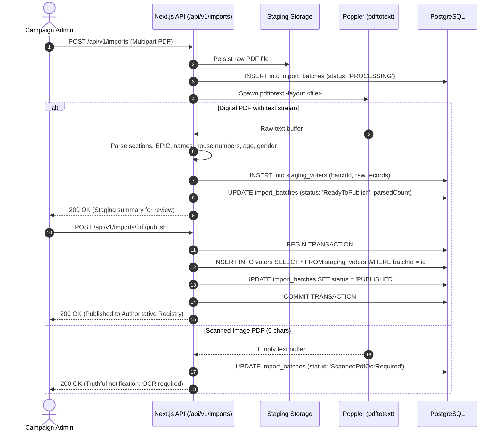
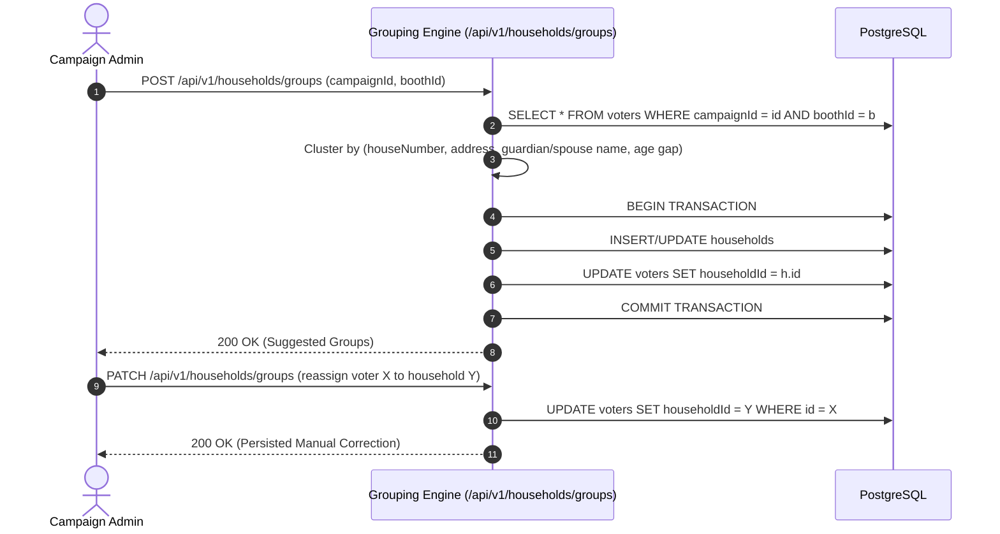
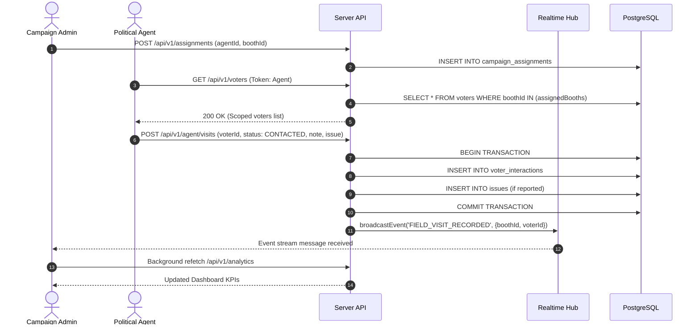
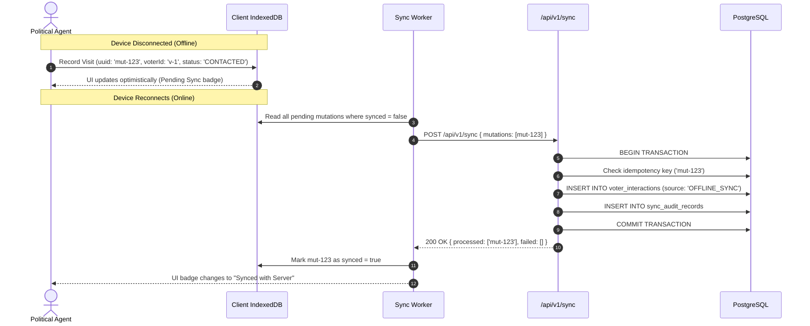
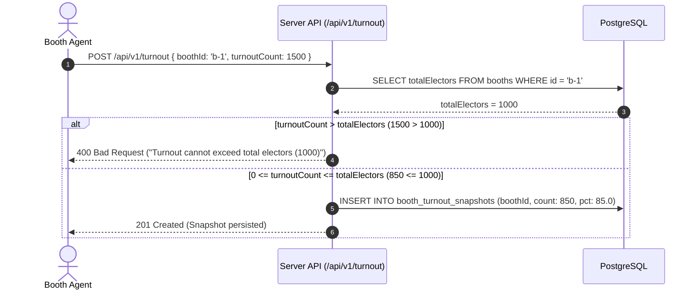
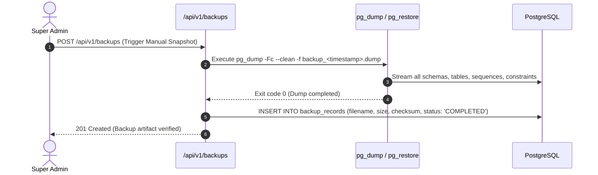

# RECOVERY STEP 13 — FINAL DATA FLOWS & TRANSACTION SPECIFICATION
# CAMPAIGNOPS AI END-TO-END DATA TRACEABILITY

## 1. Flow A: Voter Roll PDF Import to Published Voter Registry

---

## 2. Flow B: Household Grouping & Manual Correction

---

## 3. Flow C: Agent Assignment & Field Visit Recording (Online)

---

## 4. Flow D: Offline Mutation Queue & Safe Synchronization

---

## 5. Flow E: Election Day VIS & Turnout Invariant Enforcement

---

## 6. Flow F: Production Backup and Disaster Recovery

